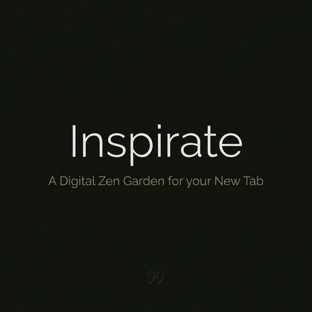
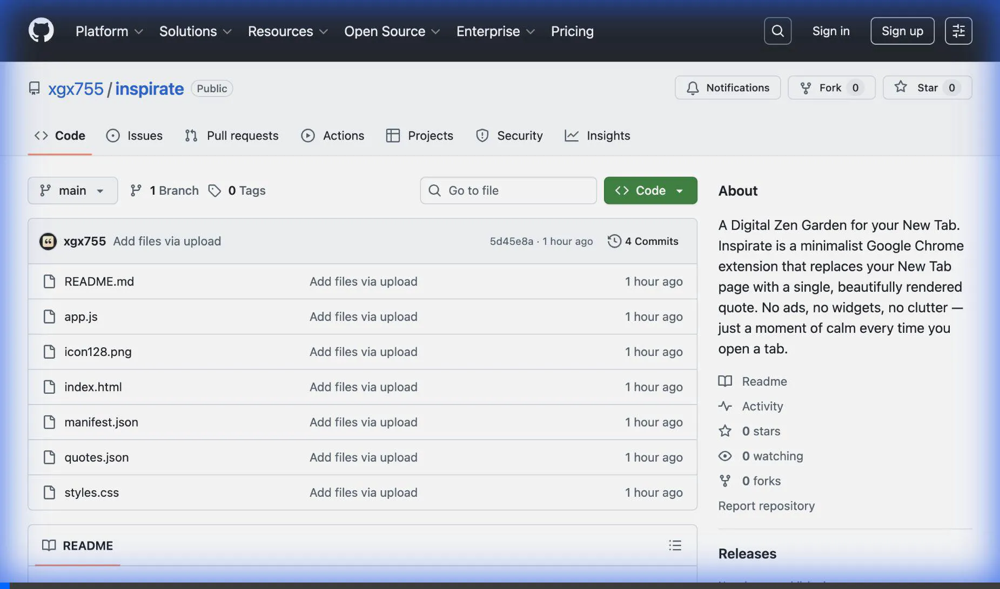
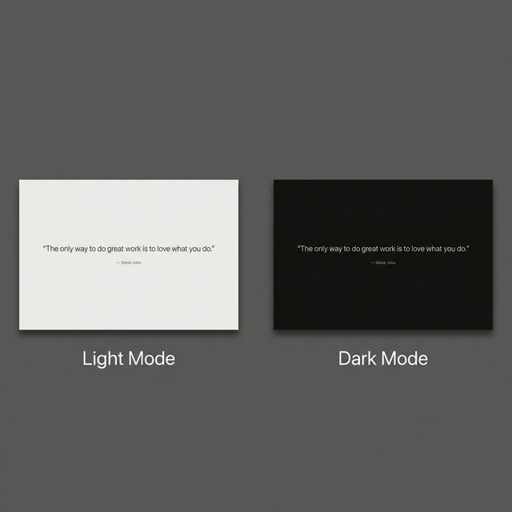

<p align="center">
  
</p>

<p align="center">
  
  
  
  
</p>

<p align="center">
  A minimalist Chrome extension that replaces your New Tab page with a single, beautifully rendered quote.<br>
  No ads. No widgets. No tracking. Just a moment of calm.
</p>

---

## ✨ Demo

<p align="center">
  
</p>

<p align="center">
  
</p>

---

## ⚡ Features

- **Instant load** — renders from a local file, matching Chrome's native New Tab speed
- **Smart shuffle** — tracks your last 10 quotes to prevent repeats
- **Adaptive theme** — auto-matches your system's light or dark mode, flicker-free
- **Responsive** — scales from 13" laptops to ultrawide monitors using CSS `clamp()`
- **Fully offline** — zero network requests, zero tracking, zero telemetry
- **Customizable** — swap in your own quotes by editing a single JSON file

---

## 🧠 Engineering Decisions

This extension was intentionally built with a "less is more" philosophy. Every technical choice serves the goal of **zero-latency, zero-compromise simplicity**.

| Decision | Technical Choice | Why It Matters |
|---|---|---|
| **No frameworks** | Vanilla HTML/CSS/JS | Achieved <100ms load time with zero dependencies |
| **Local data** | `quotes.json` fetched via `fetch()` | 100% offline — works perfectly in Airplane Mode |
| **System fonts** | `-apple-system, Segoe UI, Roboto` | Eliminates font-loading latency and layout shifts |
| **No-FOUC dark mode** | Inline critical CSS + `prefers-color-scheme` | Background color is set before any stylesheet loads |
| **Shuffle buffer** | `chrome.storage.local` last-10 index array | Prevents quote repeats without complex state management |
| **Strict CSP** | `script-src 'self'; object-src 'none'` | Blocks all external code execution by design |

---

## 🔒 Privacy First

In an era of data-hungry browser extensions, Inspirate takes a hard stance:

- **No analytics** — zero telemetry of any kind
- **No external calls** — CSP blocks all outbound requests
- **No permissions abuse** — only `storage` (for shuffle history)
- **No data collection** — your quotes stay on your machine

The extension is functionally **invisible to the network**.

---

## 🚀 Installation

1. **Download** — clone or download this repository
   ```bash
   git clone https://github.com/xgx755/inspirate.git
   ```
2. Open Chrome and navigate to `chrome://extensions`
3. Enable **Developer mode** (top-right toggle)
4. Click **Load unpacked** and select the `inspirate` folder
5. Open a **new tab** — Inspirate is live ✨

> To revert to Chrome's default New Tab, disable or remove the extension from `chrome://extensions`.

---

## 📁 Project Structure

```
inspirate/
├── manifest.json        # Chrome extension config (Manifest V3)
├── index.html           # Minimal HTML shell with inline critical CSS
├── styles.css           # Layout, responsive typography, dark mode
├── app.js               # Quote selection logic and DOM rendering
├── data/
│   └── quotes.json      # The quote dataset — edit this!
├── icons/
│   ├── icon16.png
│   ├── icon48.png
│   └── icon128.png
└── assets/              # Screenshots and demo media
```

---

## ✏️ Customizing Your Quotes

The quote dataset lives in **`data/quotes.json`** — a single file anyone can edit.

### Schema

```json
[
  { "text": "Your quote here.", "author": "Author Name" },
  { "text": "A quote with no known author." }
]
```

| Field    | Type   | Required | Description                          |
|----------|--------|----------|--------------------------------------|
| `text`   | string | **Yes**  | The quote text                       |
| `author` | string | No       | Attribution (defaults to "Anonymous")|

### How to Update

1. Open `data/quotes.json` in any text editor
2. Replace or extend the array with your own quotes
3. Save the file (make sure it's valid JSON — use [jsonlint.com](https://jsonlint.com) to check)
4. Go to `chrome://extensions` and click the **↻ reload** button on the Inspirate card
5. Open a new tab to see your quotes

### Tips

- **Minimum 1 quote** required in the array
- **No maximum** — the shuffle buffer ensures variety at any scale
- **UTF-8 encoding** — curly quotes, em dashes, and accented characters are fully supported
- If the JSON is malformed, Inspirate gracefully falls back to a default quote instead of breaking

---

## 🗺️ Roadmap

Future enhancements under consideration:

- [ ] **User-added quotes** — popup UI to add quotes without editing JSON
- [ ] **Custom themes** — user-selectable color palettes and background gradients
- [ ] **Quote categories** — tag-based filtering (philosophy, motivation, humor)
- [ ] **Keyboard shortcut** — press a key to cycle to the next quote
- [ ] **Export favorites** — save liked quotes to clipboard or PDF
- [ ] **Transition animations** — configurable entrance effects for quotes

---

## 🤝 Contributing

Contributions are welcome — whether it's a new quote, a bug fix, or a feature idea. See [CONTRIBUTING.md](CONTRIBUTING.md) for guidelines.

## 📄 License

Released under the [MIT License](LICENSE). © 2026 Zane Davis.
